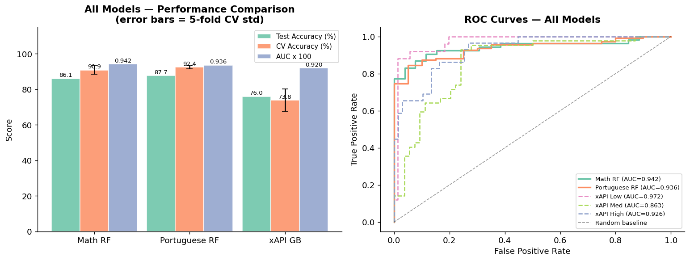
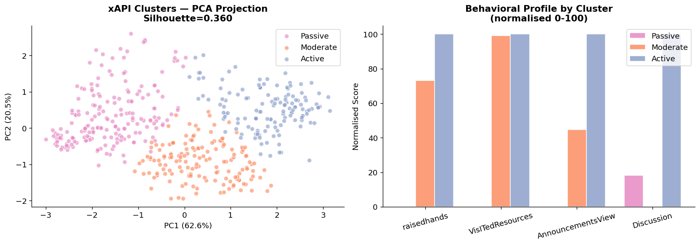
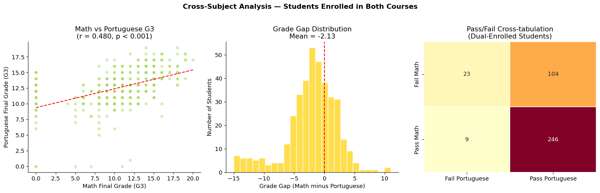
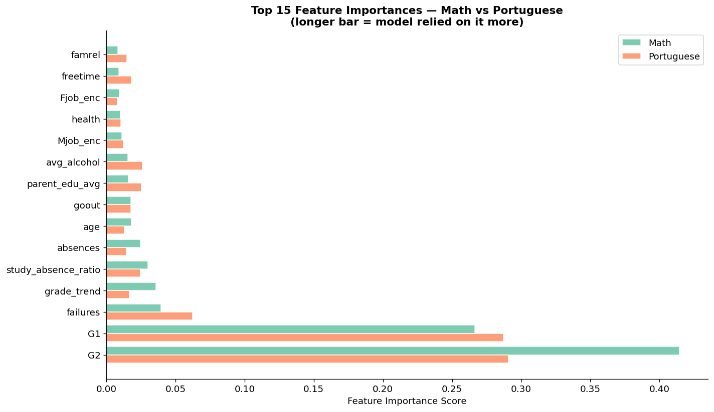
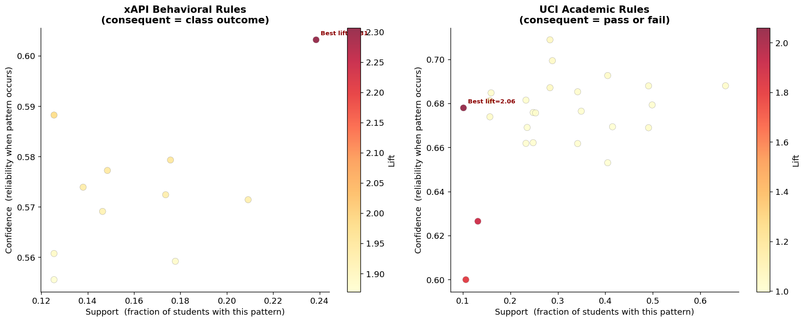

# Student Performance Analytics

Predicting student outcomes and uncovering learner profiles with data mining across three educational datasets.

MSc Data Science & AI coursework, **University of Moratuwa** (2026). Full write-up in IEEE format: [report.pdf](report.pdf).



## Overview

Schools collect grades, attendance and learning-platform activity, but rarely use it to spot struggling students early. This project applies a complete data mining pipeline to three datasets to answer:

1. Can we predict which students will pass or fail, and what drives that prediction?
2. Do students fall into natural behavioural groups?
3. Which combinations of behaviours are linked to success or failure?

## Datasets

| Dataset | Students | Target |
|---|---|---|
| UCI Student Performance – Mathematics | 395 | Pass/fail (final grade ≥ 10/20) |
| UCI Student Performance – Portuguese | 649 | Pass/fail (final grade ≥ 10/20) |
| xAPI-Edu-Data (learning-platform behaviour) | 480 | Low / Medium / High performance |

382 students are enrolled in both UCI courses, which allows a direct cross-subject comparison.

## Methods

- **Data quality audit and cleaning:** checks for missing values, duplicates and out-of-range values; label encoding; engineered features such as `grade_trend` and `study_absence_ratio`
- **Exploratory analysis:** grade distributions, cross-subject comparison, correlation heatmaps, engagement patterns
- **Classification:** Random Forest (Math and Portuguese pass/fail), Gradient Boosting (xAPI 3-class), evaluated on a held-out test set and with stratified 5-fold cross-validation
- **Clustering:** K-Means with PCA visualisation and silhouette analysis
- **Association rule mining:** Apriori (mlxtend) with support, confidence and lift
- **Statistical testing:** paired t-test and correlation across subjects

## Results

| Model | Test accuracy | AUC-ROC | 5-fold CV accuracy |
|---|---|---|---|
| Random Forest – Math pass/fail | **86.1%** | 0.942 | 90.9% ± 2.5% |
| Random Forest – Portuguese pass/fail | **87.7%** | 0.936 | 92.5% ± 0.9% |
| Gradient Boosting – xAPI 3-class | **76.0%** | 0.920 | 73.9% ± 6.3% |

The xAPI result is in line with the 73–79% range reported by Amrieh et al. (2016) on the same task.

### Key findings

- **Earlier grades dominate pass/fail prediction.** First- and second-period grades (G1, G2) are the top features for both subjects, followed by past failures. The pass/fail models are therefore best suited to a **mid-term early-warning system**, once interim grades are available.
- **Portuguese grades average 2.13 points higher than Math** for the same students (paired t-test, p < 10⁻²⁰), with a moderate correlation (r = 0.48) between subjects.
- **Three learner profiles** emerge from engagement data: *Active*, *Moderate* and *Passive* (silhouette = 0.36). They closely match actual performance classes.
- **Strongest rules:** high absence → low performance (lift 2.31); past failures + high alcohol use → fail (lift 2.06).



<details>
<summary>More figures</summary>





</details>

## Project Structure

```
├── analysis.ipynb        # Full analysis, with outputs
├── report.pdf            # IEEE-format paper
├── data/
│   ├── raw/              # Original datasets
│   └── processed/        # Cleaned datasets (generated by the notebook)
├── figures/              # All 13 figures (generated by the notebook)
└── requirements.txt
```

## Running It

```bash
git clone https://github.com/YasithaNV2001/student-performance-analytics.git
cd student-performance-analytics
python -m venv venv
venv\Scripts\activate        # macOS/Linux: source venv/bin/activate
pip install -r requirements.txt
jupyter notebook analysis.ipynb
```

All models use `random_state=42`, so results are reproducible. The notebook in this repo was last run with Python 3.11 and scikit-learn 1.8; the AUC values for two models differ from the report by less than 0.003, most likely because of newer library versions.

## Tech Stack

Python · pandas · NumPy · scikit-learn · mlxtend · SciPy · Matplotlib · seaborn · Jupyter

## Data Sources

- P. Cortez and A. Silva, "Using data mining to predict secondary school student performance," *FUBUTEC*, 2008. [UCI Machine Learning Repository](https://archive.ics.uci.edu/dataset/320/student+performance)
- E. A. Amrieh, T. Hamtini and I. Aljarah, "Mining educational data to predict student's academic performance using ensemble methods," *Int. J. Database Theory and Application*, 2016. [Kaggle: xAPI-Edu-Data](https://www.kaggle.com/datasets/aljarah/xAPI-Edu-Data)

## Author

**Yasitha Priyashan** – MSc Data Science & AI, University of Moratuwa – [GitHub](https://github.com/YasithaNV2001)
